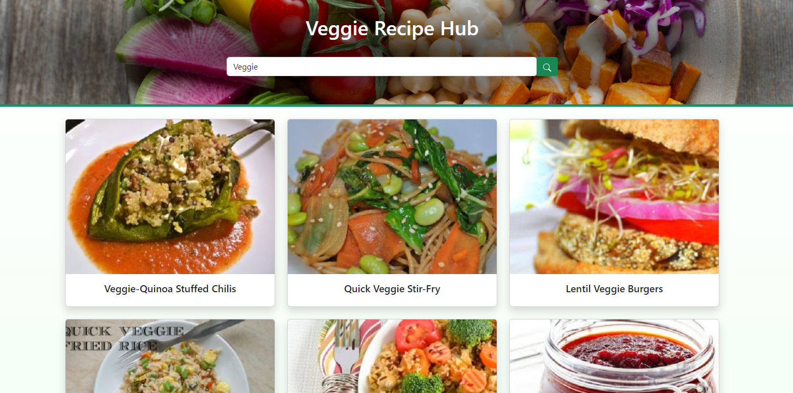
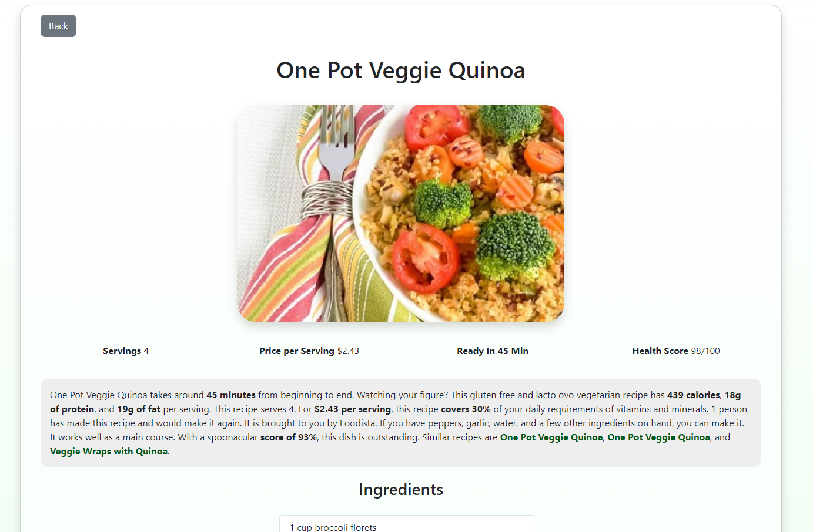

# Veggie Recipe Hub ⛅  
Veggie Recipe Hub is a web application that provides users with a diverse collection of vegetarian recipes. Users can search and browse through a variety of recipes, get details on ingredients, instructions, and preparation times, and find inspiration to create delicious and healthy dishes. The app features a slider showcasing some of the most interesting recipes, along with an advanced search function to find specific recipes.

## How it works
Users can start by searching for vegetarian recipes using keywords, ingredients, or cuisine types. The app's intuitive search feature quickly provides a list of relevant recipes.

Upon selecting a recipe from the search results or the featured recipes slider, users are presented with a detailed view. This view includes essential recipe information such as preparation time, servings, and price per serving. Users can also find a comprehensive list of ingredients and step-by-step instructions, ensuring they have all they need to cook up a delectable dish.

## Languages
* HTML5
* CSS3
* Javascript ES6
* JSX

## What i used
* [React](https://react.dev/)
* [Node.js](https://nodejs.org/it)
* [React-Router](https://reactrouter.com/en/main) 
* [Axios](https://axios-http.com/) for the API requests
* [Redux](https://redux.js.org/) for state management
* [Bootstrap](https://getbootstrap.com/) as a CSS framework I have opted for
* [LottieFiles](https://lottiefiles.com/) for JSON Animation

## API
API documentation [Spoonacular](https://spoonacular.com/food-api/docs)

## Installation
First of all, you need Node.js installed.
If you don't have it, you can download it here:
[Node.js](https://nodejs.org/it/download/) 

### 1 - Clone the repository
`git clone https://github.com/R3ddy95/VeggieRecipeHub.git`

### 2 - Install the dependencies
`npm install`

### 3 - Build it!
`npm run build`

### 4 - Open in the browser
`npm start` and go to [http://localhost:3000](http://localhost:3000) to view it in your browser.

##  Try it!
Elsewhere, you can simply try it here:
[VeggieRecipeHub](https://weatherapp-bea52.web.app/)

##  License
[MIT](https://choosealicense.com/licenses/mit/)

## Contact Me
My Email: edoardo.vitagliano3@gmail.com  
You can find my Linkedin profile here: https://www.linkedin.com/in/edoardo-vitagliano-299737110/